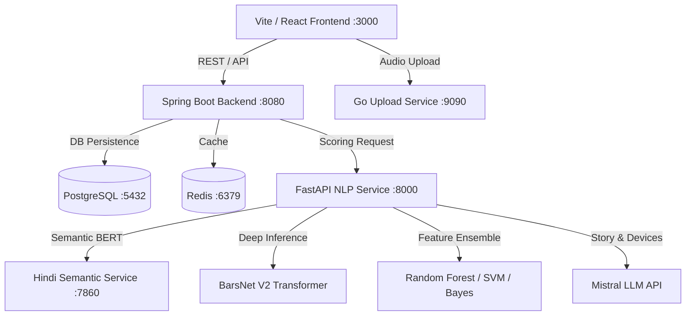

# BeatLyrix (RapRank) 🎤⚡

> **Advanced Multi-Modal Hip-Hop Lyrical Quality & AI Analysis Platform**  
> Powered by **BarsNet V2** (Deep Dual-Tower Neural Transformer with RoPE & Symmetric Co-Attention), Multi-Head Machine Learning Classifiers, and Multi-Lingual NLP.

---

## 🌟 Highlights

* **BarsNet V2 Deep Neural Network (2.39M Parameters)**: Structure-first Transformer with **Backward Rotary Position Embeddings (RoPE)**, **Rhyme Geometry 2D Convolution with Masked Spatial Pooling**, and **Symmetric Co-Attention** between Phonetic and Orthographic towers.
* **Multi-Head Consensus Engine**: Ensembles 4 independent quality-tier heads (**BarsNet V2**, **Random Forest**, **Support Vector Machine**, and **Bayesian Belief Networks**) to predict rapper skill tiers (`elite`, `mid`, `commercial`).
* **Lyrical Quality Index (LQI)**: Evaluates 16 technical, phonetic, and semantic axes including Syllable Density, Multisyllabic End-Rhyme Schemes, Wordplay (Puns, Double Entendres, Metaphors), Sound Devices (Assonance, Consonance, Onomatopoeia), and Code-Switching.
* **Microservices Architecture**: Ultra-fast React/Vite frontend, Spring Boot 3 core backend, FastAPI NLP engine, Go audio upload microservice, PostgreSQL 16 database, and Redis cache.
* **Copyright & Privacy Compliant**: Model weights encode abstract phonetic relationships without storing or distributing raw copyrighted lyrics.

---

## 🏗️ System Architecture



### Microservices Summary

| Microservice | Technology | Port | Purpose |
| :--- | :--- | :---: | :--- |
| **Frontend** | React 18, Vite, TypeScript, TailwindCSS | `3000` | Interactive UI, audio playback, metrics breakdown cards |
| **Main Backend** | Java 17, Spring Boot 3, Spring Data JPA | `8080` | REST API, track metadata, user auth, score persistence |
| **NLP Engine** | Python 3.11, PyTorch 2.x, FastAPI | `8000` | BarsNet V2 inference, G2P phoneme translation, LQI compiler |
| **Semantic Service** | PyTorch, HuggingFace (MuRIL / Hindi BERT) | `7860` | Coherence, surprisal, and lexical sophistication scoring |
| **Audio Upload** | Go 1.22 | `9090` | High-throughput chunked audio file processing |
| **Database** | PostgreSQL 16 | `5432` | Relational storage for tracks, users, scores, and comments |
| **Cache** | Redis 8 | `6379` | Fast caching and session management |

---

## 🧠 BarsNet V2 Model Architecture

BarsNet V2 is a purpose-built neural encoder/decoder for rap lyrics, designed around hip-hop structural primitives:

```
                  ┌──────────────────────────────┐
                  │ Per-Line Phoneme Sequences   │
                  └──────────────┬───────────────┘
                                 │ (Backward Positional Encoding + RoPE)
                                 ▼
                     ┌───────────────────────┐
                     │     Line Encoder      │
                     └───────────┬───────────┘
                                 │
                 ┌───────────────┴───────────────┐
                 │                               │
                 ▼                               ▼
     ┌───────────────────────┐       ┌───────────────────────┐
     │  Suffix End-Rhymes    │       │     Song Encoder      │
     └───────────┬───────────┘       └───────────┬───────────┘
                 │                               │
                 ▼                               │
   ┌───────────────────────────┐                 │
   │ Rhyme Geometry 2D Conv    │                 │
   │ & Masked Spatial Pooling  │                 │
   └─────────────┬─────────────┘                 │
                 │                               │
                 └───────────────┬───────────────┘
                                 │
                                 ▼ (Symmetric Co-Attention)
                     ┌───────────────────────┐ ◄─── CharCNN Branch
                     │ Dual-Tower Fusion     │      (Orthographic Textures)
                     └───────────┬───────────┘
                                 │
       ┌─────────────────────────┼─────────────────────────┐
       ▼                         ▼                         ▼
┌──────────────┐         ┌──────────────┐         ┌─────────────────┐
│ Tier Head    │         │ Element Head │         │ Adversarial Head│
│ (Focal Loss) │         │ (10-dim)     │         │ (Grad Reversal) │
└──────────────┘         └──────────────┘         └─────────────────┘
```

### Key Neural Components

1. **LineEncoder with Backward RoPE**: Counts position indices from the **end of each line**, ensuring second-last and last syllables align across lines where rhyme schemes exist.
2. **RhymeGeometry Conv2D & Masked Spatial Pooling**: Constructs an $L \times L$ cosine-similarity matrix of line-end suffix embeddings, processed via 2D Conv with masked spatial max/mean pooling to capture complex rhyme structures without padding distortion.
3. **Symmetric Dual-Tower Co-Attention**: Enables bidirectional cross-attention between the song-level line vectors and multi-kernel character ConvNet representations.
4. **Focal Loss Head**: Uses $\text{FocalLoss}(\gamma=2.0, \alpha=[0.915, 3.789, 0.609])$ to combat class collapse and handle label imbalances across quality tiers.

---

## 📊 Quality Tier Classification & Consensus

The system evaluates quality tier (`elite`, `mid`, `commercial`) across 4 distinct models and computes a majority-vote consensus:

* **BarsNet V2 (Deep Transformer)**: Deep neural representation over phonemes, character textures, and rhyme geometry.
* **Flow Critic (Random Forest)**: Grouped cross-validated tree ensemble.
* **The Gatekeeper (Support Vector Machine)**: Maximum-margin linear classification head.
* **The Oracle (Bayesian Network)**: Directed probabilistic graphical model (`pgmpy`).
* **Consensus Engine**: Majority vote with ties breaking toward BarsNet V2.

---

## 🛠️ Local Setup & Run Guide

### Option 1: Bare-Metal Startup (Without Docker)

Ensure PostgreSQL (port `5432`) and Redis (port `6379`) are installed and running locally, then execute:

```powershell
powershell -ExecutionPolicy Bypass -File .\run_local.ps1
```

This will automatically launch all 5 microservices in independent, persistent background windows:
- Frontend: `http://localhost:3000`
- Main API: `http://localhost:8080`
- NLP API: `http://localhost:8000/docs`

### Option 2: Docker Compose

```bash
docker-compose -f docker-compose.yml up --build
```

---

## 🔒 Copyright & Safe Repository Guidelines

All raw lyric text scraped during training research is isolated strictly under `.gitignore` rules:

```gitignore
/local_real_model/
/kaggle_dataset/
/kaggle_lyrics_dataset/
scraped_*.json
raprank-nlp/corpus/data/
```

Model weights (`barsnet.pt`) encode non-reconstructible mathematical representations of phoneme patterns and can be safely committed or shared for research without distributing copyrighted lyrics.

---

## 📜 License & Citation

Distributed for academic research and educational purposes under the MIT License.
